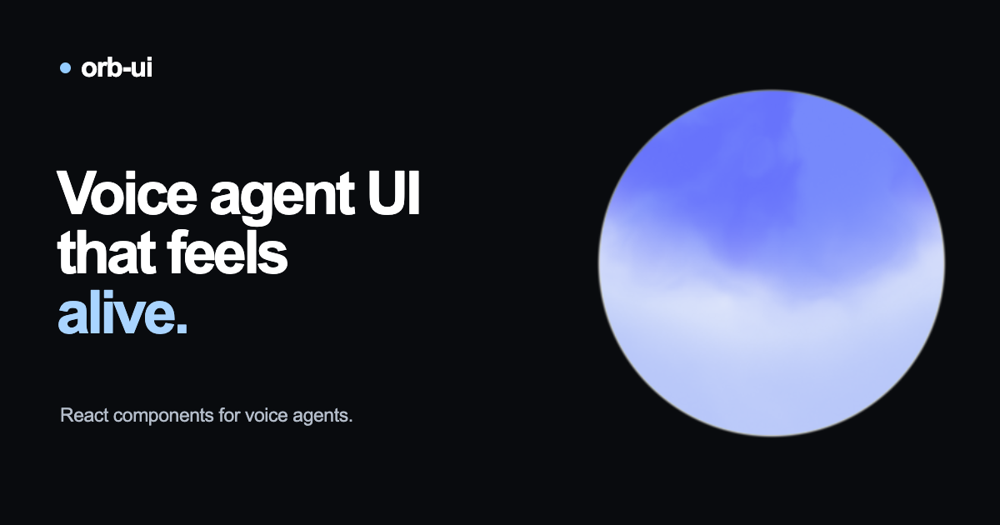

<p align="center">
  
</p>

<h1 align="center">kemo-ai</h1>

<p align="center">
  <strong>Expressive, audio-reactive voice agent UI components for React.</strong><br />
  Connect Vapi, ElevenLabs, LiveKit, Pipecat, OpenAI Live, Gemini Live, or custom WebRTC stacks through one coherent interface layer.
</p>

<p align="center">
  <a href="https://www.npmjs.com/package/kemo-ai"></a>
  <a href="https://github.com/Tanush-ai/kemo-ai/blob/main/LICENSE"></a>
  <a href="https://github.com/Tanush-ai/kemo-ai"></a>
  <a href="https://react.dev"></a>
  <a href="https://github.com/Tanush-ai/kemo-ai/actions"></a>
</p>

<p align="center">
  <a href="#quickstart">Quickstart</a> •
  <a href="#supported-providers">Supported Providers</a> •
  <a href="#themes--customization">Themes & Motion</a> •
  <a href="#api-reference">API Reference</a> •
  <a href="#architecture">Architecture</a> •
  <a href="#development">Development</a>
</p>

---

## Highlights

- 🎙️ **Universal Voice Adapter Layer**: Native adapters normalize events from Vapi, ElevenLabs, LiveKit, Pipecat, OpenAI Live/Realtime, and Gemini Live into one identical API.
- ⚡ **Directional Audio Intelligence**: Separate calibrated speech envelopes for user microphone input vs. assistant audio playback.
- 🎨 **4 Production Visual Themes**: Canvas & WebGL shaders (`circle`, `cloud`, `radial`, `bars`) designed for high-frame-rate realism.
- 🔄 **Coherent State Machine**: Eliminates UI flicker across `idle`, `connecting`, `listening`, `thinking`, `speaking`, and `error`.
- ♿ **Accessible & Compliant**: Full ARIA status reporting, keyboard focus chrome, and automatic reduced-motion adaptation.
- 🧩 **Zero Overhead**: Modular subpath exports (`kemo-ai/adapters`, `kemo-ai/adapters/livekit`), fully tree-shakeable with zero heavy runtime dependencies.

---

## Quickstart

### 1. Install

```bash
npm install kemo-ai
# or
pnpm add kemo-ai
# or
yarn add kemo-ai
```

### 2. Add to Your React App

```tsx
import { Orb } from 'kemo-ai'
import { createVapiAdapter } from 'kemo-ai/adapters'
import Vapi from '@vapi-ai/web'

const vapi = new Vapi(process.env.NEXT_PUBLIC_VAPI_KEY!)
const adapter = createVapiAdapter(vapi, { assistantId: 'your-assistant-id' })

export function VoiceAssistant() {
  return <Orb adapter={adapter} theme="circle" size={200} aria-label="Start voice assistant" />
}
```

> **Framework Tip**: `<Orb />` uses browser Web Audio and Canvas/WebGL APIs. When using Next.js App Router, mark your component with `'use client'`.

---

## Architecture

```
┌────────────────────────────────────────────────────────┐
│                   Voice Provider                       │
│  (Vapi / ElevenLabs / LiveKit / OpenAI / Gemini / etc) │
└───────────────────────────┬────────────────────────────┘
                            │ Raw Audio & Events
                            ▼
┌────────────────────────────────────────────────────────┐
│                   kemo-ai Adapter                      │
│      • Audio analysis & envelope calibration           │
│      • Directional metering (input vs output)          │
│      • Session lifecycle normalization                │
└───────────────────────────┬────────────────────────────┘
                            │ Normalized OrbSignal
                            │ { state, inputVolume, outputVolume }
                            ▼
┌────────────────────────────────────────────────────────┐
│                     <Orb />                            │
│      • Theme renderers (Circle, Cloud, Radial, Bars)   │
│      • Autonomous drift & state transitions            │
│      • ARIA accessibility & keyboard chrome            │
└────────────────────────────────────────────────────────┘
```

---

## Supported Providers

Install the lightweight SDK corresponding to your voice infrastructure:

| Provider               | Installation                          | Adapter Factory                                 | Entrypoint                 |
| :--------------------- | :------------------------------------ | :---------------------------------------------- | :------------------------- |
| **Vapi**               | `npm i kemo-ai @vapi-ai/web`          | `createVapiAdapter(client, config)`             | `kemo-ai/adapters`         |
| **ElevenLabs**         | `npm i kemo-ai @elevenlabs/client`    | `createElevenLabsAdapter(Conversation, config)` | `kemo-ai/adapters`         |
| **LiveKit**            | `npm i kemo-ai livekit-client`        | `createLiveKitAdapter(config)`                  | `kemo-ai/adapters/livekit` |
| **Pipecat**            | `npm i kemo-ai @pipecat-ai/client-js` | `createPipecatAdapter(client, config)`          | `kemo-ai/adapters`         |
| **OpenAI GPT-Live**    | `npm i kemo-ai` _(WebRTC native)_     | `createOpenAILiveAdapter(config)`               | `kemo-ai/adapters`         |
| **OpenAI Realtime**    | `npm i kemo-ai` _(WebRTC native)_     | `createOpenAIRealtimeAdapter(config)`           | `kemo-ai/adapters`         |
| **Google Gemini Live** | `npm i kemo-ai @google/genai`         | `createGeminiLiveAdapter(config)`               | `kemo-ai/adapters`         |
| **Custom Stack**       | `npm i kemo-ai`                       | Controlled mode via `signal={...}`              | `kemo-ai`                  |

---

## Provider Integration Guides

### ElevenLabs Conversational AI

```tsx
import { Conversation } from '@elevenlabs/client'
import { Orb } from 'kemo-ai'
import { createElevenLabsAdapter } from 'kemo-ai/adapters'

const adapter = createElevenLabsAdapter(Conversation, {
  agentId: 'your-agent-id',
})

export function ElevenLabsOrb() {
  return <Orb adapter={adapter} theme="circle" aria-label="Start ElevenLabs session" />
}
```

### LiveKit Agents

```tsx
import { Orb } from 'kemo-ai'
import { createLiveKitAdapter } from 'kemo-ai/adapters/livekit'

const adapter = createLiveKitAdapter({
  tokenEndpoint: '/api/livekit-token',
  agentName: 'customer-support',
})

export function LiveKitOrb() {
  return <Orb adapter={adapter} theme="cloud" aria-label="Start LiveKit session" />
}
```

### OpenAI GPT-Live (WebRTC)

```tsx
import { Orb } from 'kemo-ai'
import { createOpenAILiveAdapter } from 'kemo-ai/adapters'

const adapter = createOpenAILiveAdapter({
  createSession: async (sdp, signal) => {
    const res = await fetch('/api/openai-live-session', {
      method: 'POST',
      headers: { 'Content-Type': 'application/json' },
      body: JSON.stringify({ sdp }),
      signal,
    })
    return res.json()
  },
})

export function OpenAILiveOrb() {
  return <Orb adapter={adapter} theme="radial" aria-label="Start GPT-Live session" />
}
```

### Google Gemini Live

```tsx
import { GoogleGenAI } from '@google/genai'
import { Orb } from 'kemo-ai'
import { createGeminiLiveAdapter } from 'kemo-ai/adapters'

const adapter = createGeminiLiveAdapter({
  connect: async (callbacks) => {
    const token = await fetch('/api/gemini-token', { method: 'POST' }).then((r) => r.json())
    const ai = new GoogleGenAI({ apiKey: token.value, httpOptions: { apiVersion: 'v1alpha' } })
    return ai.live.connect({ model: token.model, config: token.config, callbacks })
  },
})

export function GeminiOrb() {
  return <Orb adapter={adapter} theme="circle" aria-label="Start Gemini Live session" />
}
```

### Controlled Mode (Custom Runtime / Testing)

You can directly drive the visualizer with explicit reactive state:

```tsx
import { Orb } from 'kemo-ai'
import type { OrbSignal } from 'kemo-ai'

export function CustomOrb({ state, inputVolume, outputVolume }: OrbSignal) {
  return <Orb signal={{ state, inputVolume, outputVolume }} theme="cloud" size={240} />
}
```

---

## Themes & Customization

`kemo-ai` includes 4 built-in themes optimized for different product aesthetics:

| Theme    | Best For                | Description                                                               |
| :------- | :---------------------- | :------------------------------------------------------------------------ |
| `circle` | Clean SaaS / Mobile     | Minimal glowing particle sphere with subtle breathing and volume scaling. |
| `cloud`  | Assistant / Ambient     | Volumetric fluid cloud with smooth chromatic bloom and organic drift.     |
| `radial` | Telephony / Calling     | Geometric 4-lobe membrane with integrated interactive call controls.      |
| `bars`   | Audio Tools / Equalizer | Modern rounded frequency bars reacting dynamically to audio bandwidth.    |

### Motion Presets

Each theme supports three motion personalities:

- `calm`: Subtle amplitude response, longer easing, ideal for professional enterprise tools.
- `balanced` _(default)_: Natural conversational pacing with clear activity feedback.
- `expressive`: High dynamic range and reactive deformations for engaging consumer apps.

```tsx
<Orb
  adapter={adapter}
  theme={{
    name: 'circle',
    preset: 'calm',
    appearance: {
      colors: {
        listening: '#60a5fa',
        speaking: '#f472b6',
      },
    },
  }}
/>
```

### CSS Variables

You can configure styling externally through typed CSS tokens:

```css
.my-voice-card {
  --orb-ui-size: min(80vw, 320px);
  --orb-ui-circle-appearance-colors-speaking: #38bdf8;
  --orb-ui-radial-control-surround: #0a0a0a;
}
```

---

## API Reference

### `<Orb />` Props

| Prop          | Type                             | Default    | Description                                                                           |
| :------------ | :------------------------------- | :--------- | :------------------------------------------------------------------------------------ |
| `adapter`     | `OrbAdapter`                     | —          | Provider adapter instance managing session lifecycle and metering.                    |
| `signal`      | `OrbSignal`                      | —          | Controlled state object `{ state, inputVolume, outputVolume, error }`.                |
| `theme`       | `OrbThemeName \| OrbThemeConfig` | `'circle'` | Theme name or typed configuration object with presets and overrides.                  |
| `size`        | `number`                         | `200`      | Diameter in pixels (can also be driven via `--orb-ui-size`).                          |
| `interactive` | `boolean`                        | `true`     | When `false`, suppresses internal click-to-start controls for passive display.        |
| `renderTheme` | `OrbThemeRenderer`               | —          | Render prop to provide completely custom Canvas, SVG, or WebGL visualizers.           |
| `slotProps`   | `OrbSlotProps`                   | —          | Classnames and HTML attributes for semantic DOM slots (`root`, `surface`, `control`). |
| `onStart`     | `() => void`                     | —          | Custom callback invoked when starting a session.                                      |
| `onStop`      | `() => void`                     | —          | Custom callback invoked when stopping a session.                                      |

### Voice States (`OrbState`)

```ts
type OrbState = 'idle' | 'connecting' | 'listening' | 'thinking' | 'speaking' | 'error'
```

---

## Development

```bash
# Clone repository
git clone https://github.com/Tanush-ai/kemo-ai.git
cd kemo-ai

# Install dependencies
pnpm install

# Run the interactive demo playground locally
pnpm dev:demo

# Build the library
pnpm build

# Run all quality checks (lint, format, types, unit tests, e2e)
pnpm check
```

---

## License

MIT © [Tanush-ai](https://github.com/Tanush-ai/kemo-ai)
